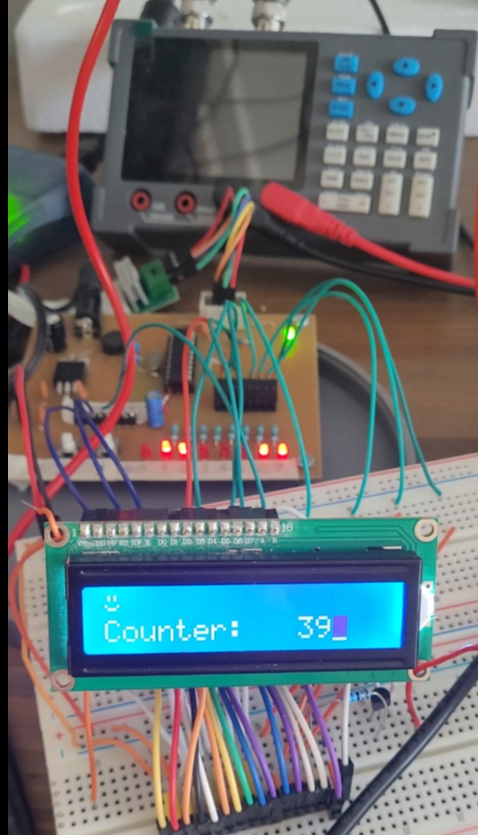

# PCB-design-an-32bit-MCU-Developer-Board-by-PADS
This repository contains the complete Printed Circuit Board (PCB) design files for a 32-bit MCU Developer Board. The design was created using the PADS suite of tools and includes all schematics, layout files, and documentation needed to replicate and manufacture the board.

